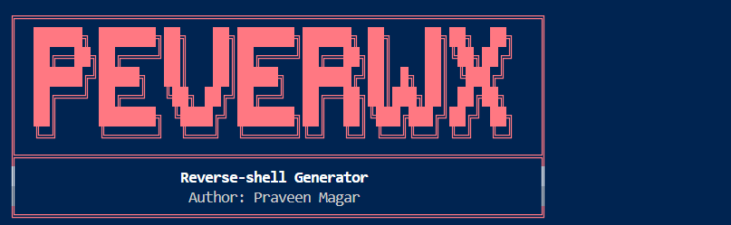

# Reverse-shell Generator

A menu-driven, multi-encoder reverse shell payload generator for penetration testers and cybersecurity enthusiasts.

---

<p align="center">
  
</p>


## Features

- Generate reverse shells for **Python, Bash, PHP**
- Multiple encoding/obfuscation options: **Base64, Hex, ROT13, XOR, Whitespace/Comment Insertion**
- Interactive or command-line mode
- Colorized terminal output
- Personalized for: **Praveen Magar**

---

## Installation

1. **Clone the repository:**
    ```bash
    git clone https://github.com/Praveenmagar/reverse-shell-generator.git
    cd reverse-shell-generator
    ```

2. **Install dependencies:**
    ```bash
    pip install colorama
    ```

---

## Installation on Linux 
1. Clone the repository
git clone https://github.com/Praveenmagar/reverse-shell-generator.git

2. Change into the project directory
cd reverse-shell-generator

3. Install the required Python package
pip3 install colorama

4. Run the generator (interactive mode)
python3 generator.py

5. Or, run with command-line arguments (example)
python3 generator.py --ip 10.10.10.10 --port 4444 --payload python --encoder xor --output shell.py
## Usage

**Interactive:**
```bash
python generator.py


